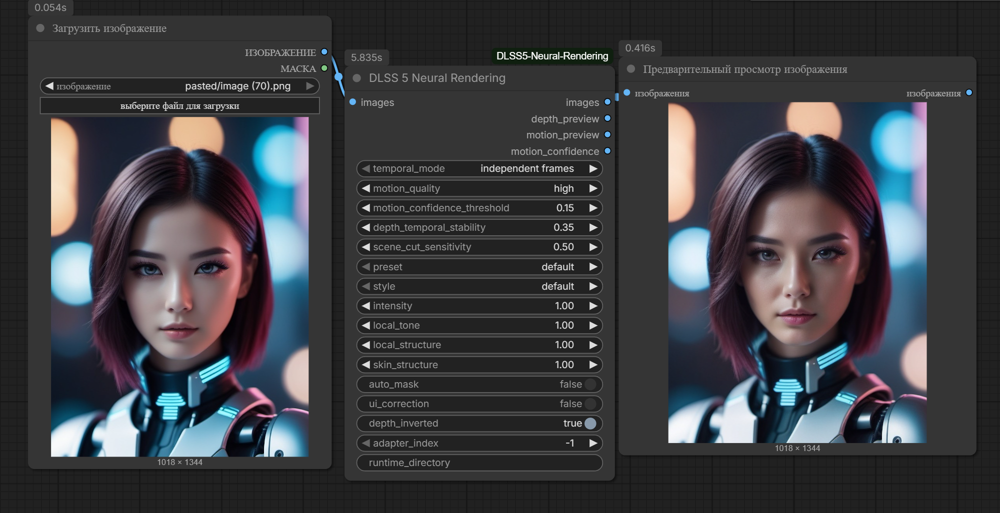
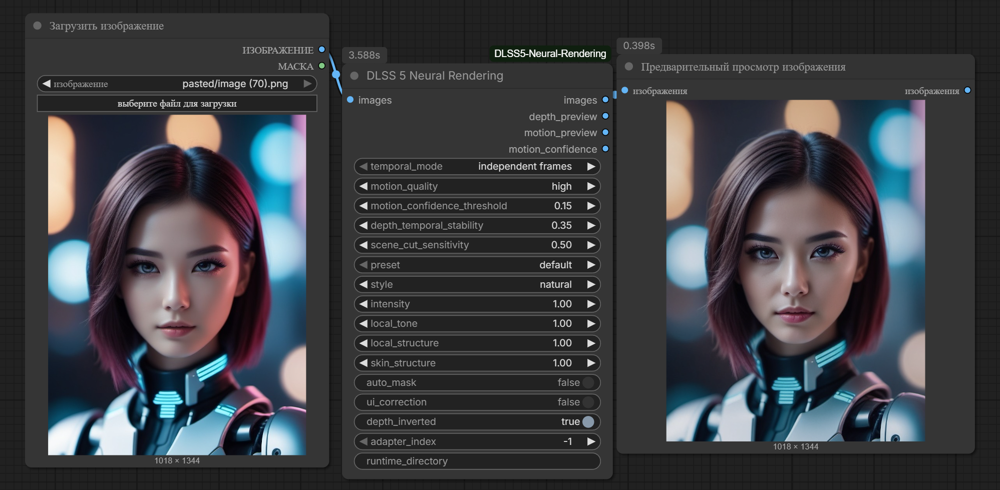
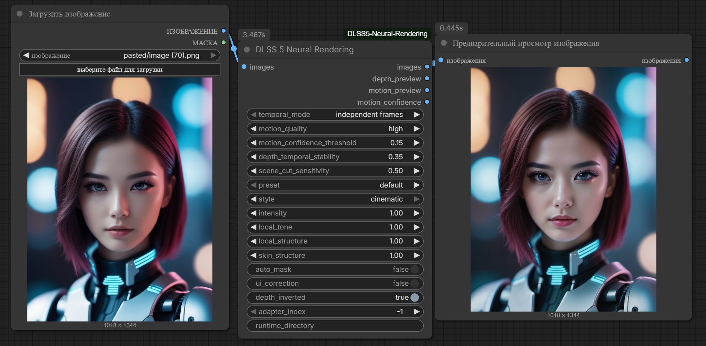

# ComfyUI DLSS 5 Neural Rendering

> [!WARNING]
> Experimental Windows/NVIDIA proof of concept. It uses an experimental NGX
> feature contract that may change between runtime or driver versions. This
> project is not affiliated with or endorsed by NVIDIA.

An experimental Windows custom node that invokes NVIDIA's DLSS Neural Rendering
feature 18 as a headless Direct3D 12 post-process. It is a normal ComfyUI node:
connect an `IMAGE` or video-frame batch and receive an `IMAGE` batch back.

The implementation has no Unity, ReShade, game, window, swapchain, or geometry
dependency. A short-lived native worker is managed automatically by the Python
node so an experimental NGX runtime failure cannot take the ComfyUI process down.

## Image examples

All three examples use the same input and default preset; only `style` changes.

### Default



### Natural



### Cinematic



## Requirements

- Windows 10/11, a supported NVIDIA RTX GPU, and a compatible NVIDIA driver.
- A current ComfyUI build with native Depth Anything 3 support.
- An NVIDIA-signed `nvngx_dlssnr.dll`. The DLL is **not** redistributed here.
- The included `bin/dlssnr_worker.exe` (already present in this repository).
- `depth_anything_3_mono_large.safetensors` in ComfyUI's `geometry_estimation`
  model folder. The model is **not** redistributed here.

## Installation — Windows portable build

The two required locations are:

```text
ComfyUI_windows_portable\
├── python_embeded\
└── ComfyUI\
    ├── custom_nodes\
    │   └── ComfyUI-DLSS5-Neural-Rendering\
    │       ├── bin\dlssnr_worker.exe
    │       ├── nodes.py
    │       └── ...
    └── models\
        ├── dlssnr\
        │   └── nvngx_dlssnr.dll
        └── geometry_estimation\
            └── depth_anything_3_mono_large.safetensors
```

### 1. Install the custom node

Open PowerShell in the **portable root folder** — the folder containing both
`python_embeded` and `ComfyUI` — then run:

```powershell
git clone https://github.com/aiplatforms-ru/ComfyUI-DLSS5-Neural-Rendering.git .\ComfyUI\custom_nodes\ComfyUI-DLSS5-Neural-Rendering
```

Alternatively, download the repository ZIP and extract its contents to exactly:

```text
ComfyUI_windows_portable\ComfyUI\custom_nodes\ComfyUI-DLSS5-Neural-Rendering\
```

Do not leave an extra nested folder such as
`ComfyUI-DLSS5-Neural-Rendering-main\ComfyUI-DLSS5-Neural-Rendering-main\`.

### 2. Copy the DLSS Neural Rendering runtime

Create this folder if it does not exist:

```powershell
New-Item -ItemType Directory -Force .\ComfyUI\models\dlssnr
```

Copy your legally obtained, NVIDIA-signed `nvngx_dlssnr.dll` into it. The final
absolute layout must be:

```text
<portable root>\ComfyUI\models\dlssnr\nvngx_dlssnr.dll
```

For example, if the portable build is installed at `E:\ComfyUI`, the exact path
is:

```text
E:\ComfyUI\ComfyUI\models\dlssnr\nvngx_dlssnr.dll
```

**Do not copy the DLL into RHI, a game directory, or another program's cache.**
The node has no automatic dependency on any of those locations. The DLL is not
included in this repository.

### 3. Install Depth Anything 3 Mono Large

Put the ComfyUI single-file model at:

```text
<portable root>\ComfyUI\models\geometry_estimation\depth_anything_3_mono_large.safetensors
```

The compatible model is available from
[Comfy-Org/Depth-Anything-3](https://huggingface.co/Comfy-Org/Depth-Anything-3/blob/main/geometry_estimation/depth_anything_3_mono_large.safetensors).
If ComfyUI's built-in Depth Anything 3 workflow has already downloaded it, no
additional model copy is needed.

### 4. Restart ComfyUI

ComfyUI imports custom-node Python code only during startup. Fully close and
restart ComfyUI after installing or updating this node.

## Installation — venv or manual ComfyUI

Clone the repository under the same ComfyUI installation that you run:

```powershell
cd C:\path\to\ComfyUI\custom_nodes
git clone https://github.com/aiplatforms-ru/ComfyUI-DLSS5-Neural-Rendering.git
cd ComfyUI-DLSS5-Neural-Rendering
```

Copy the DLL to:

```text
C:\path\to\ComfyUI\models\dlssnr\nvngx_dlssnr.dll
```

Copy `depth_anything_3_mono_large.safetensors` to:

```text
C:\path\to\ComfyUI\models\geometry_estimation\depth_anything_3_mono_large.safetensors
```

The node loads it through ComfyUI's own Depth Anything 3 implementation. It does
not create a Transformers cache or download a second copy. Motion estimation is
provided by the included D3D12 worker and does not require another neural model.

## Runtime location

The normal and recommended location is always:

```text
ComfyUI\models\dlssnr\nvngx_dlssnr.dll
```

The advanced `runtime_directory` widget and `COMFYUI_DLSSNR_RUNTIME` environment
variable are explicit user overrides only. When both are empty, the node uses
only its own ComfyUI model directory. It never searches RHI, games, DriverStore,
or another application's cache.

## Build the native backend

From PowerShell:

```powershell
./native/build_backend.ps1
```

The script obtains the official NVIDIA DLSS 310.7.0 SDK from
<https://github.com/NVIDIA/DLSS> when it is not already cached, then creates
`bin/dlssnr_worker.exe`. To use an existing SDK tree:

```powershell
./native/build_backend.ps1 -NgxSdkPath C:\SDKs\DLSS-310.7.0
```

## Inputs and video behavior

- `target_megapixels = 0` preserves the input dimensions. A positive value
  resizes every frame once before processing, preserving aspect ratio and rounding
  dimensions to a multiple of 8. For example, `4.0` produces approximately four
  million pixels per frame.
- `passes` performs 1-5 genuinely chained DLSS-NR evaluations. Pass 2 consumes
  pass 1's output, and so on. Depth Anything 3 guides, D3D12 optical flow, and
  NGX sequence history are restarted and recomputed for every pass. The model is
  loaded only once, and later passes reuse the output tensor in place instead of
  allocating another video-sized batch.
- `independent frames` runs Depth Anything 3 Mono Large separately on every image,
  normalizes each guide independently, and resets NGX history for every frame.
- `video sequence` is strictly causal. For frame N, Depth Anything sees only N.
  The native D3D12 worker compares N with its previous luminance pyramid and
  produces current-to-previous pixel motion immediately before NGX. NGX keeps
  its own internal history. No future frame, full-video normalization, or
  multi-frame depth window is used.
- Motion is a GPU-resident coarse-to-fine patch-matching pipeline. It searches
  from 1/128 through 1/64, 1/32, 1/16, and 1/8 resolution, applies median and
  confidence-weighted depth-aware filtering, then expands to full-resolution
  `RG16_FLOAT` pixel vectors. `balanced`, `high`, and `maximum` select increasing
  coarse search radii.
- There are no depth or motion-vector sockets to configure. The node constructs
  both guide buffers internally and sends each frame to NGX immediately.
- `motion_quality` controls the shader search radius. The confidence threshold
  rejects vectors that fail pattern, spatial-consistency, and temporal checks.
- `depth_temporal_stability` smooths only the causal running normalization range;
  it does not feed previous or future images into the depth network.
- `scene_cut_sensitivity` controls when DLSS history and depth-range history reset.
- `depth_preview`, `motion_preview`, and `motion_confidence` are inspectable IMAGE
  outputs generated from the exact guide arrays sent to the native worker. They
  are allocated only when connected, so unused diagnostics consume no video-sized
  batch. With multiple passes they show the exact guides from the final pass.
  Depth is grayscale; motion hue shows direction and brightness magnitude.
- `adapter_index = -1` automatically selects the first suitable NVIDIA adapter.
  Non-negative indices select among NVIDIA adapters in high-performance order.

DLSS Neural Rendering was designed for raster inputs with true depth and motion.
Unity obtains those buffers directly from its scene renderer. An encoded video
contains neither buffer, so this node reconstructs depth with Depth Anything 3
and motion with the native D3D12 optical-flow shader rather than substituting
flat or zero placeholders.

## Technical notes

Color and output use `RGBA16_FLOAT`, motion uses `RG16_FLOAT`, and depth uses
`R32_FLOAT`. Only one frame's color and depth are staged in shared memory at a
time. Motion, its luminance pyramid, and its one-frame history remain on the D3D12
GPU. Motion/confidence are read back only when their diagnostic outputs are
connected. The worker keeps one D3D12 device and one feature instance alive for
the sequence, exactly so both flow and NGX history persist between frames.
Depth Anything 3 uses ComfyUI's native single-file model loader and model manager;
the cached model object is reused across executions and can be offloaded by
ComfyUI when VRAM is needed elsewhere.

The feature-18 contract is experimental and not part of the stable public NGX
API. Runtime 310.x is the currently tested ABI. The architecture is informed by
the public direct-D3D12 `UnityDLSSNR` proof of concept and NVIDIA's public NGX
SDK. The worker links the public NGX SDK under NVIDIA's SDK terms; see
`THIRD_PARTY_NOTICES.md`. The proprietary experimental runtime DLL is not
redistributed.

## Licensing

Original source code is available under the MIT License. The prebuilt worker
also incorporates NVIDIA NGX SDK object code and remains subject to NVIDIA's
RTX SDK terms. Depth model weights and all other referenced projects retain
their own licenses. See `THIRD_PARTY_NOTICES.md` before redistributing a build.

References:

- <https://github.com/Kuan-Mi/UnityDLSSNR>
- <https://github.com/ByteDance-Seed/Depth-Anything-3>
- <https://github.com/umar-afzaal/LumeniteFX>
- <https://gpuopen.com/manuals/fidelityfx_sdk/techniques/optical-flow/>
- <https://github.com/jlrouzies-fr/DLSS5-Feeder>
- <https://github.com/NVIDIA/DLSS>
- <https://www.nvidia.com/en-us/geforce/news/dlss5-breakthrough-in-visual-fidelity-for-games/>
